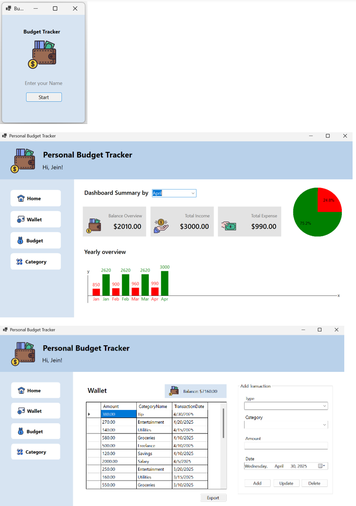

# Personal Budget Tracker (WinForms, C#)

🖼️ Preview Image

🎥 Demo Video: https://youtu.be/

📋 Description
- A lightweight Windows desktop application for tracking personal finances.  

| Stack | Description |
|-------|-------------|
| Language | C# |
| Framework | .NET Framework 4.x |
| UI | Windows Forms |
| Database | Microsoft SQL Server Express |
| Platform | Windows Desktop |

✨ Features
- Track expenses by category and date
- Monthly budget limits and overspending alerts
- SQL Server integration with persistent local data
- Filter and export budget records
- Simple UI using WinForms (C#)
- Custom category management (add/edit/delete)

